```mermaid
flowchart TD

    %% ── External entry points ────────────────────────────────────────────
    M6(["👤 M6 UI\nPOST /api/v1/query\nX-Tenant-ID · X-User-ID\n[Kong-injected headers]"])
    M1S(["🔌 M1 Structural Cycle\n{tid}.m1.semantic_interpretation_requested\n[Kafka — per-tenant regex sub]"])

    %% ── Two distinct agents ───────────────────────────────────────────────
    subgraph M2["🧠 M2 · AI Intelligence Hub"]
        direction TB

        %% ── Executive Agent ─────────────────────────────────────────────
        subgraph EXEC["Executive RHMA Agent  ·  m2/agents/executive/"]
            direction TB

            FA["FastAPI endpoint\nm2/api/query.py\nPOST /api/v1/query\nInstantiates AgentState\nLaunches graph async"]

            subgraph STATE["AgentState  (TypedDict — immutable header + mutable body)"]
                direction LR
                SI["IMMUTABLE\nuser_query\ntenant_id\nuser_id\nsession_id"]
                SM["MUTABLE\nintent\nsubtasks: list[dict]\nagent_results: Annotated[list, add]\nfinal_response\nsources\nreasoning_trace\nsafety_approved\nsafety_rejection_reason"]
            end

            FA -->|"initial AgentState\n(empty mutable fields)"| SGRAPH

            subgraph SGRAPH["LangGraph State Machine  ·  m2/agents/executive/graph.py"]
                direction TB

                subgraph L1["Layer 1 · Reasoning"]
                    IC["intent_classifier\nFast LLM call · no tools\nclassifies → finance | hr\n| operations | general"]
                    TD["task_decomposer\nBreaks query into 1–3 subtasks\nJSON output: [{description,\ndomain, priority}]"]
                    IC -->|"state.intent set\nreasoning_trace[0] written"| TD
                end

                subgraph L2["Layer 2 · Hierarchical"]
                    SV["supervisor\nReads state.intent\nSelects domain agent\nvia conditional edge"]
                end

                TD -->|"state.subtasks set\nreasoning_trace[1] written"| SV

                subgraph L3["Layer 3 · Multi-Agent  ·  m2/agents/executive/domain_agents.py"]
                    direction LR
                    FA2["finance_agent\nEntities: transaction · party\nStores: vector + graph\n+ timeseries"]
                    HA["hr_agent\nEntities: employee\nStores: vector + graph"]
                    OA["operations_agent\nEntities: incident · product\nStores: vector + graph"]
                end

                SV -->|"finance"| FA2
                SV -->|"hr"| HA
                SV -->|"operations\n(general → finance)"| OA

                subgraph L4["Layer 4 · Safety  ·  m2/agents/executive/safety.py"]
                    direction TB
                    SL["safety_layer\n1. Cross-tenant source scan\n   source.tenant_id ≠ session tenant → BLOCK\n2. OPA policy check\n   POST /v1/data/nexus/allow\n   {user_id, tenant_id, intent,\n   entity_types, response_length}\n3. Fail-closed: OPA unreachable → deny"]
                    RP["response_publisher\nMerges domain agent partial responses\nPublishes to\n{tid}.m2.agent_response_ready\n[Kafka]"]
                end

                FA2 -->|"state.agent_results += [{domain,\nresponse, sources}]"| SL
                HA  -->|"state.agent_results += [{domain,\nresponse, sources}]"| SL
                OA  -->|"state.agent_results += [{domain,\nresponse, sources}]"| SL

                SL -->|"safety_approved = True"| RP
                SL -->|"safety_approved = False\n→ END (response blocked)"| BLOCKED["⛔ END\nResponse cleared\nRejection reason logged"]
            end
        end

        %% ── Structural Agent ────────────────────────────────────────────
        subgraph STRAGENT["Structural Agent  ·  m2/agents/structural_agent.py"]
            direction TB
            SC["StructuralAgent.run()\nKafka regex subscription:\n.*\\.m1\\.semantic_interpretation_requested\nAuto-discovers new tenant topics"]
            SPROC["_process(message)\n1. Deserialise SourceKnowledgeArtifact\n2. Build user_prompt with schema tables\n3. LLM call (claude-sonnet-4)\n4. Parse JSON proposals\n5. Filter field_proposals < 0.50 confidence"]
            SOUT["ProposedInterpretation\nentity_proposals\nfield_proposals (confidence ≥ 0.50)\nrelationship_proposals\nidentity_alignment_proposals"]
            SC --> SPROC --> SOUT
        end

        %% ── Shared session / M3 access layer ────────────────────────────
        subgraph SESSION["M3 Query Session  ·  m2/agents/executive/session.py"]
            direction LR
            QV["query_m3_vector()\ntenant_id · entity_type\nquery_text · top_k=5"]
            QG["query_m3_graph()\ntenant_id · cypher · params\n(tenant_id always in WHERE)"]
            QT["query_m3_timeseries()\ntenant_id · sql · params"]
            WAIT["_publish_and_wait()\nPublishes knowledge_query event\nPolls knowledge_query_result\nTimeout: 10 seconds\nFail → empty result, logged"]
            QV & QG & QT --> WAIT
        end
    end

    %% ── LLM calls (shared) ────────────────────────────────────────────────
    subgraph LLM["☁️  LLM Layer"]
        CLAUDE["claude-sonnet-4-20250514\nvia Anthropic SDK\n(API key from Secrets Manager)"]
    end

    %% ── External systems M3 ────────────────────────────────────────────────
    subgraph M3["🗃️  M3 · AI Database Engine (via Kafka only)"]
        direction LR
        PIN["Pinecone\nVector search\nIndex per tenant"]
        NEO["Neo4j\nGraph traversal\nTenant property filter\non every node"]
        TSD["TimescaleDB\nTime-series aggregation\nRow-Level Security\nper tenant"]
    end

    %% ── OPA policy engine ─────────────────────────────────────────────────
    OPA["🔒 Open Policy Agent\nnexus-opa.nexus-infra\nPolicy: nexus/allow\nValidates: user role · entity types\nPII exposure rules"]

    %% ── Kafka topics ──────────────────────────────────────────────────────
    subgraph KAFKA["⚡ Kafka — Cross-module topics (per-tenant {tid} prefix)"]
        direction LR
        KQ["{tid}.m2.knowledge_query\n→ M3 Writers"]
        KR["{tid}.m2.knowledge_query_result\n← M3 Writers"]
        KA["{tid}.m2.agent_response_ready\n→ M6 WebSocket"]
        KSI["{tid}.m1.semantic_interp_requested\n← M1 Structural Cycle"]
        KSO["{tid}.m2.semantic_interp_complete\n→ M4 CDM Governance Queue"]
    end

    %% ── System prompt (Structural Agent) ─────────────────────────────────
    subgraph SPROMPT["📋 Structural Agent System Prompt (constant)"]
        direction TB
        SP1["Canonical entities: party · transaction\nproduct · employee · incident"]
        SP2["Confidence rules:\n≥ 0.95 → near-certain\n0.80–0.94 → plausible, human review\n0.50–0.79 → uncertain, flag clearly\n< 0.50 → do not propose"]
        SP3["Exclusions:\nSystem/audit fields (created_at,\nupdated_at, write_date…) → source_extras\nNever auto-apply — propose only"]
    end

    %% ═══════════════════════════════════════════════════════════════════
    %% RELATIONSHIPS
    %% ═══════════════════════════════════════════════════════════════════

    %% Entry
    M6 -->|"POST /api/v1/query\nX-Tenant-ID · X-User-ID"| FA
    M1S -->|"SourceKnowledgeArtifact\nin NexusMessage payload"| SC

    %% Executive agent LLM calls
    IC  -->|"single-turn prompt\ndomain classification"| CLAUDE
    TD  -->|"JSON decomposition prompt\n1–3 subtasks"| CLAUDE
    FA2 -->|"synthesis prompt\nwith knowledge context"| CLAUDE
    HA  -->|"synthesis prompt\nwith knowledge context"| CLAUDE
    OA  -->|"synthesis prompt\nwith knowledge context"| CLAUDE

    %% Structural agent LLM call
    SPROC -->|"schema prompt\n+ system prompt"| CLAUDE

    %% Domain agents → M3 via session layer
    FA2 & HA & OA -->|"query_m3_vector()\nquery_m3_graph()\nquery_m3_timeseries()"| SESSION

    %% Session → Kafka → M3
    WAIT -->|"publishes\nknowledge_query"| KQ
    KQ   -->|"routed to appropriate\nM3 writer"| PIN & NEO & TSD
    PIN & NEO & TSD -->|"results published"| KR
    KR   -->|"polled by\n_publish_and_wait()"| WAIT

    %% Safety → OPA
    SL   -->|"POST /v1/data/nexus/allow\n{user_id, tenant_id,\nintent, entity_types}"| OPA
    OPA  -->|"{result: true|false}"| SL

    %% Response → M6
    RP   -->|"session_id · response_text\nsources · reasoning_trace"| KA

    %% Structural → M4
    SOUT -->|"ProposedInterpretation\npublished"| KSO

    %% System prompt reference
    SPROMPT -.->|"injected as\nsystem prompt"| SPROC

    %% ── Styling ───────────────────────────────────────────────────────────
    classDef layer1  fill:#1a1a3a,stroke:#9b5de5,color:#bc9de5
    classDef layer2  fill:#1a2a3a,stroke:#3d9be0,color:#7db8e0
    classDef layer3  fill:#2a1a12,stroke:#f4a231,color:#f4c071
    classDef layer4  fill:#1a2a1a,stroke:#2dcc70,color:#7ddaaa
    classDef safety  fill:#2a1a1a,stroke:#e55d5d,color:#e59d9d
    classDef kafka   fill:#0e1118,stroke:#3d5a80,color:#6a90b0
    classDef m3style fill:#0d1a1a,stroke:#20b2aa,color:#60d0c8
    classDef llm     fill:#1a1230,stroke:#7b68ee,color:#b8aaf0
    classDef state   fill:#0f1320,stroke:#445060,color:#c8d0e0
    classDef entry   fill:#0d0f14,stroke:#556070,color:#8898b0
    classDef struct  fill:#1e1a10,stroke:#d4a017,color:#e8c96a
    classDef opa     fill:#1a0d0d,stroke:#c0392b,color:#e57d7d
    classDef blocked fill:#2a0808,stroke:#e55d5d,color:#e55d5d

    class IC,TD layer1
    class SV layer2
    class FA2,HA,OA layer3
    class RP layer4
    class SL safety
    class KQ,KR,KA,KSI,KSO kafka
    class PIN,NEO,TSD m3style
    class CLAUDE llm
    class SI,SM state
    class M6,M1S entry
    class SC,SPROC,SOUT struct
    class OPA opa
    class BLOCKED blocked
```

# NEXUS — RHMA Multi-Agent Library Architecture
**M2 · AI Intelligence Hub · Mentis Consulting · February 2026**

---



---

## RHMA Layer Summary

| Layer | Nodes | LLM calls | M3 access | Blocking? |
|---|---|---|---|---|
| **1 · Reasoning** | `intent_classifier` → `task_decomposer` | 2 × fast Claude calls | None | Yes — sequential |
| **2 · Hierarchical** | `supervisor` | None (conditional edge only) | None | Yes — routing only |
| **3 · Multi-Agent** | `finance_agent` \| `hr_agent` \| `operations_agent` | 1 × synthesis call per agent | Via session layer (Kafka, 10s timeout) | Yes — awaits M3 results |
| **4 · Safety** | `safety_layer` → `response_publisher` | None | None | Yes — fail-closed (OPA down = deny) |

## Key Invariants

| Invariant | Mechanism |
|---|---|
| Safety cannot be bypassed | LangGraph: all domain agent edges go to `safety_layer` only — no direct edge to `response_publisher` |
| Tenant context is immutable | `tenant_id` / `user_id` set once in `AgentState` at session start — no node can overwrite them |
| M3 never called directly | Domain agents call `session.py` functions; session.py uses Kafka only — no direct SDK calls to Pinecone / Neo4j / TimescaleDB |
| LLM hallucination contained | Each synthesis prompt includes `TENANT CONTEXT: {tenant_id} — do not reference data from any other company` |
| OPA fail-closed | `requests.RequestException` → `allowed = False` — unreachable OPA denies the response |
| Cross-tenant check before OPA | Source `tenant_id` scan runs before OPA call — OPA never receives contaminated input |
| Structural Agent proposals only | System prompt rule 1: *"You propose mappings only. You NEVER auto-apply them."* |
| Sub-0.50 proposals discarded | `filter(fp.confidence >= 0.50)` applied before publishing `ProposedInterpretation` |

## File Structure

```
m2/
├── agents/
│   ├── structural_agent.py          # StructuralAgent class — Kafka consumer loop
│   └── executive/
│       ├── graph.py                 # build_rhma_graph() · AgentState · Layer 1/2/4 nodes
│       ├── domain_agents.py         # _domain_agent() factory · finance/hr/operations registrations
│       ├── safety.py                # safety_layer_node() · OPA client · cross-tenant scan
│       └── session.py               # query_m3_vector/graph/timeseries · _publish_and_wait()
└── api/
    └── query.py                     # FastAPI POST /api/v1/query · async graph invocation
```

---
*NEXUS M2 · RHMA Multi-Agent Library Architecture · Mentis Consulting · February 2026 · Confidential*
