```mermaid
flowchart TD

    %% ── External actors ──────────────────────────────────────────────────────
    USER(("👤 Business User\n/ Data Steward"))

    subgraph SOURCES["🗄️ Enterprise Sources"]
        direction LR
        SF["Salesforce\nAirbyte"]
        SN["ServiceNow\nAirbyte"]
        OD["Odoo\nAirbyte"]
        PG["PostgreSQL\nDebezium CDC"]
        MY["MySQL\nDebezium CDC"]
        SS["SQL Server\nDebezium CDC"]
    end

    %% ── M5 Platform ──────────────────────────────────────────────────────────
    subgraph M5["⚙️  M5 · Platform"]
        direction LR
        OKTA["Okta\nOIDC Auth Server\n+ custom tenant_id claim"]
        KONG["Kong\nAPI Gateway\nJWT validation"]
        KAFKA["Kafka Cluster\nper-tenant topic provisioning"]
        INFRA["AWS EKS · ArgoCD\nGrafana · Prometheus"]
    end

    %% ── nexus_core ───────────────────────────────────────────────────────────
    subgraph CORE["📦 Core · Tech Lead"]
        direction LR
        NCORE["nexus_core library\nNexusMessage · TenantContext\nCrossModuleTopicNamer · RLS"]
        OIDC["OIDC_ISSUER_URL\noidc.py · get_oidc_config()"]
        IDMAP["identity_mapping table\nnexus_user_id → source_user_id\nseeded for all 6 systems"]
        PROV["provisioning.py\nonboard_tenant() · Kafka topics\nCDM v1.0 initialisation"]
    end

    %% ── M1 ───────────────────────────────────────────────────────────────────
    subgraph M1["🔌 M1 · Data Intelligence & Mediation"]
        direction TB
        CONN["6 Connectors\n3× Airbyte · 3× Debezium"]
        CDM["CDM Mapper\nTier 1 → silent\nTier 2 → flagged\nTier 3 → source_extras"]
        ROUTER["AI Store Router\nentity-type routing rules"]
        STRIG["Structural Sub-Cycle Trigger\ndetects unknown fields"]
    end

    %% ── M3 ───────────────────────────────────────────────────────────────────
    subgraph M3["🗃️  M3 · AI Database Engine"]
        direction LR
        VEC["Vector Writer\nPinecone\nParty · Employee · Product"]
        GRAPH["Graph Writer\nNeo4j\nParty · Transaction · Incident"]
        TS["TimeSeries Writer\nTimescaleDB\nTransaction · metrics"]
    end

    %% ── M2 ───────────────────────────────────────────────────────────────────
    subgraph M2["🧠 M2 · AI Intelligence Hub"]
        direction TB
        STRUCT["Structural Agent\nLLM schema interpretation\nProposes CDM extensions"]
        EXEC["Executive RHMA Agent\nOrchestrates Finance + HR sub-agents\nSafety layer · cross-tenant check"]
    end

    %% ── M4 ───────────────────────────────────────────────────────────────────
    subgraph M4["⚡ M4 · Workflow & Integration"]
        direction TB
        GOV["CDM Governance Queue\nKafka consumer + FastAPI\nApprove / reject CDM proposals"]
        MEQ["Mapping Exception Queue\nDeduplicates Tier 2 flags\nPromotes mapping Tier 2 → Tier 1"]
        TEMP["Temporal Workflow Engine\nOnboardingWorkflow\nPENDING → COMPLETED state machine"]
    end

    %% ── M6 ───────────────────────────────────────────────────────────────────
    subgraph M6["🖥️  M6 · Adaptive User Interface"]
        direction TB
        LOGIN["Okta Login Flow\nnext-auth + PKCE\nJWT session"]
        GCONS["CDM Governance Console\n+ Mapping Review Console\nReads M4 REST endpoints"]
        CHAT["AI Chat Interface\nWebSocket to M2\nReasoning trace display"]
        HEALTH["Pipeline Health Dashboard\nPrometheus polling\nKafka consumer lag panels"]
    end

    %% ── Integration & Testing ────────────────────────────────────────────────
    subgraph TEST["🧪 Integration & Testing"]
        direction LR
        T1["Happy path E2E\nSource change → M1 → M3 → M2 → M6"]
        T2["Structural cycle test\nUnknown field → M2 → M4 → M1 Tier 1"]
        T3["Multi-tenant isolation\ntest-alpha vs test-beta"]
        T4["Okta identity test\nJWT → Kong → identity_mapping"]
        T5["Performance baseline\nVector &lt;50ms · Graph &lt;100ms"]
        MS[["✦ Iteration 1 Sign-Off\nWeek 14"]]
    end

    %% ═══════════════════════════════════════════════════════════════════════
    %% RELATIONSHIPS
    %% ═══════════════════════════════════════════════════════════════════════

    %% Sources → M1
    SOURCES -->|"raw records\n[Airbyte pull / Debezium CDC]"| CONN

    %% M1 internal pipeline
    CONN -->|"raw records batch\n[Kafka m1.int.raw_records]"| CDM
    CDM -->|"routing decision per entity type\n[Kafka m1.int.cdm_entities_ready]"| ROUTER
    CDM -->|"Tier 2 field detected\n[Kafka m1.int.mapping_failed]"| STRIG

    %% M1 → M3
    ROUTER -->|"cdm_entities_ready\n→ Vector [Party, Employee, Product]"| VEC
    ROUTER -->|"cdm_entities_ready\n→ Graph [Party, Transaction, Incident]"| GRAPH
    ROUTER -->|"cdm_entities_ready\n→ TimeSeries [Transaction, metrics]"| TS

    %% M1 → M2 (Structural cycle)
    STRIG -->|"semantic_interpretation_requested\n[Kafka {tid}.m1.semantic_interp]"| STRUCT

    %% M1 → M4 (Tier 2 mapping exceptions)
    CDM -->|"mapping_failed Tier 2 event\n[Kafka m1.int.mapping_failed]"| MEQ

    %% M3 → M2 (knowledge retrieval)
    VEC -->|"semantic search results\n[direct query, tenant-scoped index]"| EXEC
    GRAPH -->|"relationship traversal results\n[Cypher query, tenant graph space]"| EXEC
    TS -->|"time-series aggregations\n[SQL query, tenant partition]"| EXEC

    %% M2 → M4
    STRUCT -->|"extension_proposed\n[Kafka {tid}.m2.cdm_extension_proposed]"| GOV
    EXEC -->|"workflow_trigger\n[Kafka {tid}.m2.workflow_trigger]"| TEMP

    %% M4 → M1 (cache invalidation loop)
    GOV -->|"version_published → CDM Registry cache invalidation\n[Kafka {tid}.m4.mapping_approved]"| CDM
    MEQ -->|"mapping_approved → CDM Registry cache invalidation\n[Kafka {tid}.m4.mapping_approved]"| CDM

    %% M4 → M6 (REST API)
    GOV -->|"GET /api/v1/governance/proposals\nPOST /approve · /reject"| GCONS
    MEQ -->|"GET /api/v1/mappings/exceptions\nPOST /approve · /reject"| GCONS
    TEMP -->|"GET /api/v1/workflows\nPOST /signal [approve/reject]"| GCONS

    %% M2 → M6 (AI chat)
    EXEC -->|"agent_response_ready\n[WebSocket streaming]"| CHAT

    %% M5 auth flow
    OKTA -->|"JWKS public keys\n/.well-known/openid-configuration"| KONG
    KONG -->|"validated JWT → injects\nX-Tenant-ID · X-User-ID · X-User-Email"| M4
    KONG -->|"validated JWT → injects\nX-Tenant-ID · X-User-ID"| M2

    %% nexus_core → all modules (dashed = shared import)
    NCORE -.->|"NexusMessage envelope\nTenantContext · get_tenant_scoped_connection()\nCrossModuleTopicNamer"| M1
    NCORE -.->|"NexusMessage · TenantContext\nCDMRegistryService"| M2
    NCORE -.->|"NexusMessage · TenantContext\nRLS connection pool"| M3
    NCORE -.->|"NexusMessage · TenantContext\nNexusProducer / NexusConsumer"| M4
    OIDC  -.->|"OIDC_ISSUER_URL\nget_oidc_config() · validate_env()"| M6
    IDMAP -.->|"get_source_identity()\n[Iteration 2 RBAC enforcement]"| M2

    %% M5 infrastructure → all (dashed = underlying platform)
    KAFKA -.->|"per-tenant topics provisioned\n[{tid}.m1.* · {tid}.m2.* · {tid}.m4.*]"| M1
    KAFKA -.->|"per-tenant topics"| M2
    KAFKA -.->|"per-tenant topics"| M4
    INFRA -.->|"Kubernetes · ArgoCD · Grafana\nPrometheus metrics"| HEALTH

    %% User flows
    USER -->|"browser login\nOkta PKCE flow"| LOGIN
    LOGIN -->|"authenticated session + JWT\ngates all M6 surfaces"| GCONS
    LOGIN -->|"authenticated session + JWT"| CHAT
    USER -->|"natural language query"| CHAT
    USER -->|"approve / reject / override\nCDM proposals + mapping exceptions"| GCONS

    %% Testing depends on all modules
    M1 -.->|"6 connectors live\nCDM Mapper + Router active"| T1
    M3 -.->|"all 3 stores populated\nwith real M1 data"| T1
    M2 -.->|"Executive Agent\nquerying live M3 stores"| T1
    M4 -.->|"governance flow\nand Temporal active"| T1
    M6 -.->|"all UI surfaces live\nwith real Okta auth"| T1

    T1 -->|"pipeline confirmed\nend-to-end"| T2
    T1 -->|"data isolation\nverified per tenant"| T3
    T1 -->|"identity chain\nJWT → source system"| T4
    T3 -->|"isolation confirmed"| T5
    T2 & T3 & T4 & T5 -->|"all gates passed"| MS

    %% ── Styling ──────────────────────────────────────────────────────────────
    classDef m5style    fill:#0d1a12,stroke:#2dcc70,color:#7ddaaa
    classDef corestyle  fill:#0d1220,stroke:#3d9be0,color:#7db8e0
    classDef m1style    fill:#150d20,stroke:#9b5de5,color:#bc9de5
    classDef m3style    fill:#0d1a1a,stroke:#20b2aa,color:#60d0c8
    classDef m2style    fill:#1a140a,stroke:#f4a231,color:#f4c071
    classDef m4style    fill:#0d1028,stroke:#5d7de5,color:#9db0e5
    classDef m6style    fill:#1a0d0d,stroke:#e55d5d,color:#e59d9d
    classDef teststyle  fill:#111318,stroke:#667080,color:#99a8b8
    classDef milestone  fill:#e55d5d,stroke:#ff4040,color:#fff
    classDef userstyle  fill:#0f1320,stroke:#445060,color:#c8d0e0

    class OKTA,KONG,KAFKA,INFRA m5style
    class NCORE,OIDC,IDMAP,PROV corestyle
    class CONN,CDM,ROUTER,STRIG m1style
    class VEC,GRAPH,TS m3style
    class STRUCT,EXEC m2style
    class GOV,MEQ,TEMP m4style
    class LOGIN,GCONS,CHAT,HEALTH m6style
    class T1,T2,T3,T4,T5 teststyle
    class MS milestone
    class USER userstyle
```

# NEXUS — Module Architecture
**Mentis Consulting · Iteration 1 · February 2026**

---

---

## Reading the diagram

| Line style | Meaning |
|---|---|
| Solid `→` | Kafka event (async) or REST API call (sync) |
| Dashed `-.->` | Shared library import, infrastructure dependency, or Iteration 2 enforcement |
| Label on arrow | Topic name, HTTP endpoint, or data type being transferred |

**Critical path (top → bottom):**
`Okta + Kong` → `nexus_core` → `M1 connectors` → `CDM Mapper + Router` → `M3 integration` → `M2 Executive Agent` → `Happy path E2E` → `Sign-off`

**Cache invalidation loop (M4 → M1):**
When a data steward approves a CDM proposal or mapping exception in M6, M4 publishes `mapping_approved` on Kafka. M1's CDM Mapper subscribes to this topic and flushes its CDM Registry cache, activating the new Tier 1 mapping on the next record batch — without a service restart.

---
*NEXUS Iteration 1 · Mentis Consulting · February 2026 · Confidential*
