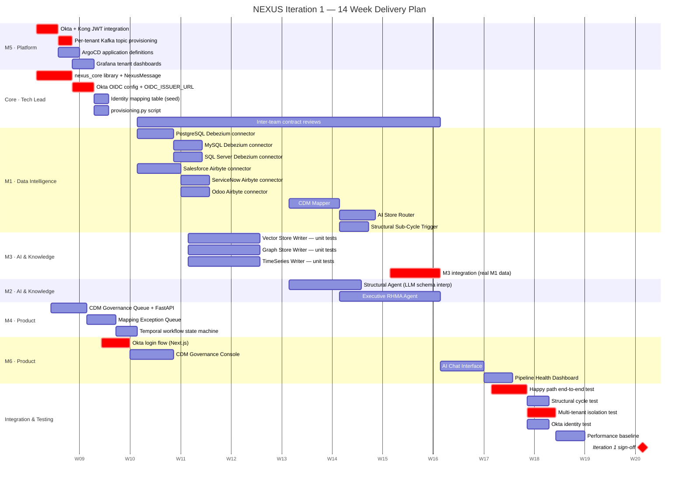

# NEXUS — Iteration 1 Gantt Chart
**Mentis Consulting · February 2026 · Confidential**

---



---

## Phase Summary

| Phase | Scope | Owner | Weeks | Gate |
|---|---|---|---|---|
| **Phase 0** | M5 completion — Okta+Kong, Kafka topics, ArgoCD, Grafana | Platform + Tech Lead | W1–2 | Hard gate — nothing starts until done |
| **Phase 1** | nexus_core, OIDC config, identity mapping table | Tech Lead | W1–2 | Hard gate — all teams depend on library |
| **Phase 2** | M1 connectors — all 6 real sources | Data Intelligence | W3–6 | Real data flowing on Kafka |
| **Phase 3** | M1 CDM Mapper, AI Store Router, Structural Trigger | Data Intelligence | W5–8 | CDM entities flowing to M3 |
| **Phase 4** | M3 writers — Vector, Graph, TimeSeries | AI & Knowledge | W4–8 | Knowledge stores populated |
| **Phase 5** | M2 Structural Agent + Executive RHMA Agent | AI & Knowledge | W6–11 | AI queries working on real data |
| **Phase 6** | M4 Governance Queue + Exception Queue | Product | W1–2 | Human review flow active |
| **Phase 7** | M6 — Okta login, Governance Console, Chat, Health | Product | W2–9 | UI live with real Okta auth |
| **Phase 8** | End-to-end integration + multi-tenant isolation tests | All teams | W12–14 | ✅ Iteration 1 complete |

---

## Critical Path

The following tasks are on the critical path — any delay cascades to the final sign-off date:

1. **Okta + Kong JWT integration** (Platform) — nothing authenticates without this
2. **nexus_core + OIDC_ISSUER_URL** (Tech Lead) — all application code depends on this
3. **M1 connectors** (Data Intelligence) — M3 and M2 cannot integrate without real data
4. **M3 integration with real M1 data** (AI & Knowledge) — M2 Executive Agent needs populated stores
5. **Okta login flow in M6** (Product) — all UI features require authenticated sessions
6. **Happy path + multi-tenant isolation tests** (All) — sign-off blocked until both pass

---

## Key Dependencies

```
Okta dev org registered (Tech Lead, Day 1)
    ↓
nexus_core OIDC config  ──────────────────────────→  M6 Okta login
    ↓
Kong JWT plugin (Platform)
    ↓
M1 Connectors (all 6)
    ↓
M1 CDM Mapper → M1 AI Store Router
    ↓
M3 Writers integration ───────────────────────────→  M2 Executive Agent
    ↓
End-to-end happy path test
    ↓
✅ Iteration 1 sign-off  (Week 14)
```

---

## OIDC Configuration Note

NEXUS uses a single environment variable to support any OIDC-compliant IdP.
Swapping from the dev Okta org to a client's corporate IdP is a one-line config change — no code change required.

```
# Development / Demo (Okta developer org)
OIDC_ISSUER_URL=https://dev-xxxxx.okta.com

# Enterprise Client A (their Okta)
OIDC_ISSUER_URL=https://acme.okta.com

# Enterprise Client B (Azure AD)
OIDC_ISSUER_URL=https://login.microsoftonline.com/{tenant}/v2.0
```

---

*NEXUS Iteration 1 Gantt · Mentis Consulting · February 2026 · Confidential*